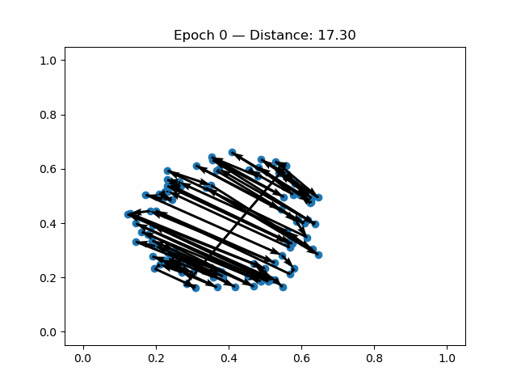
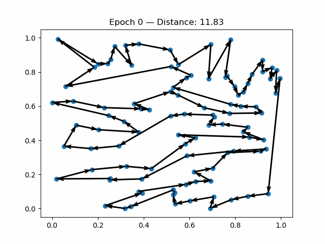
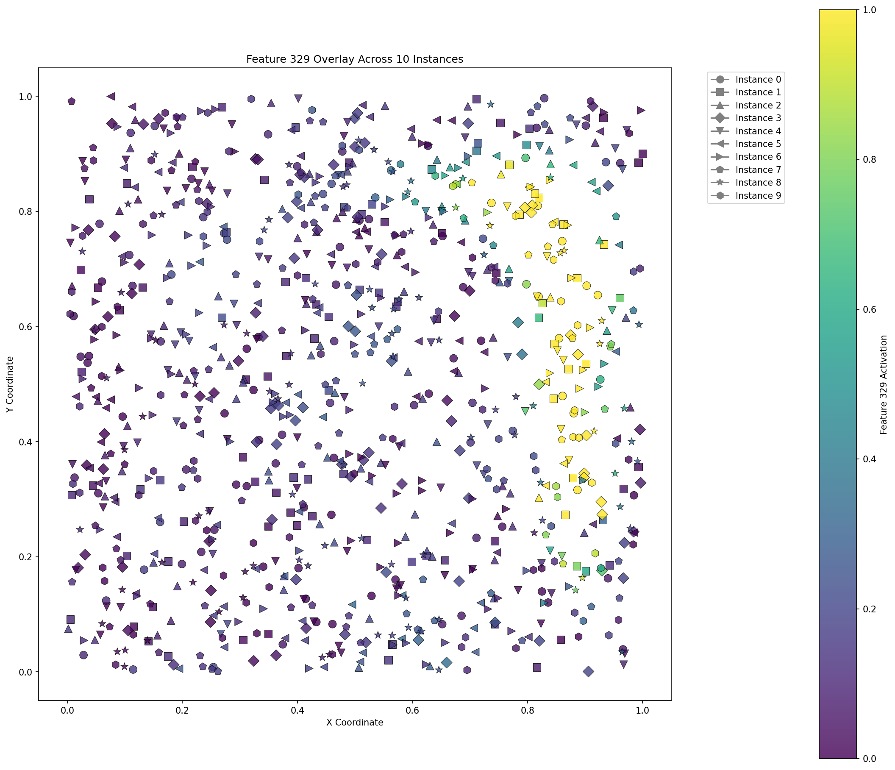
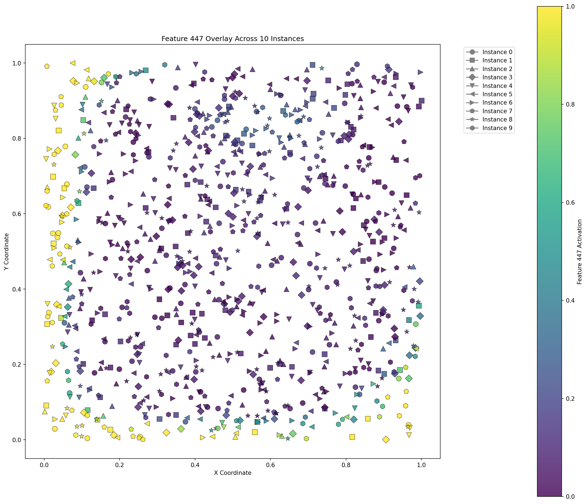
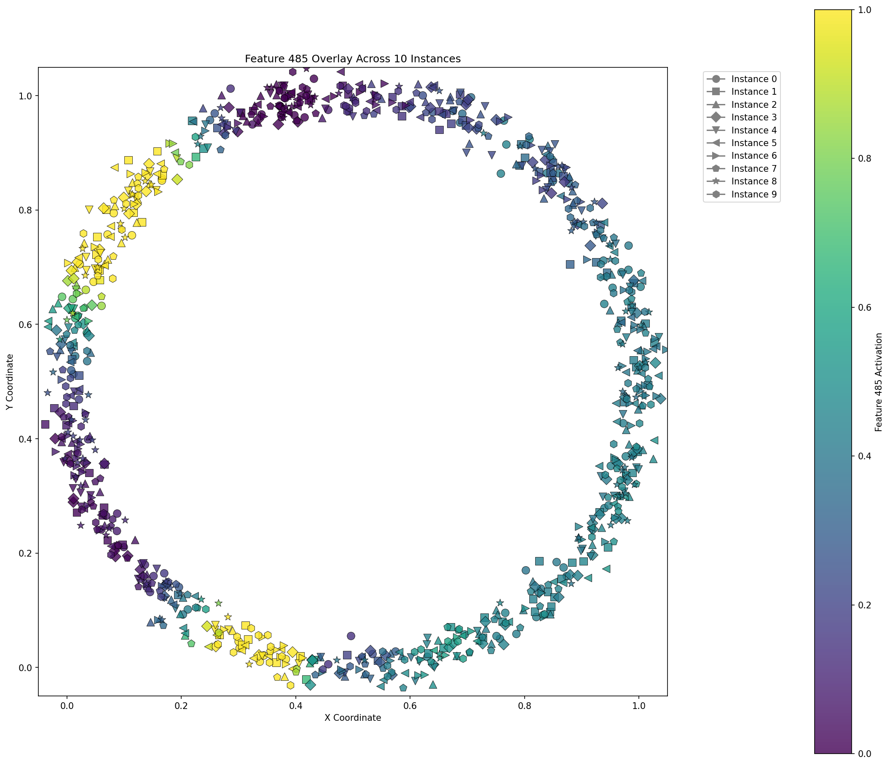
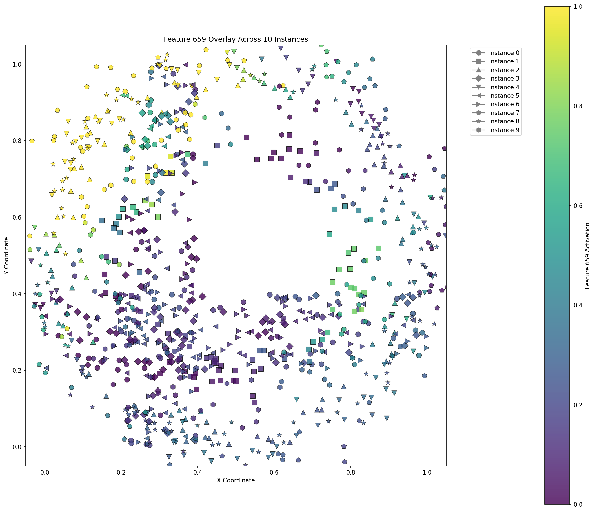
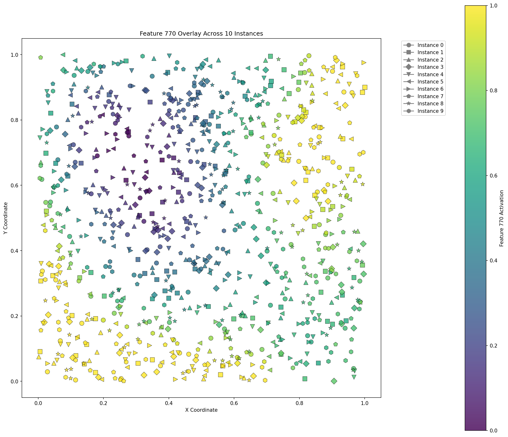
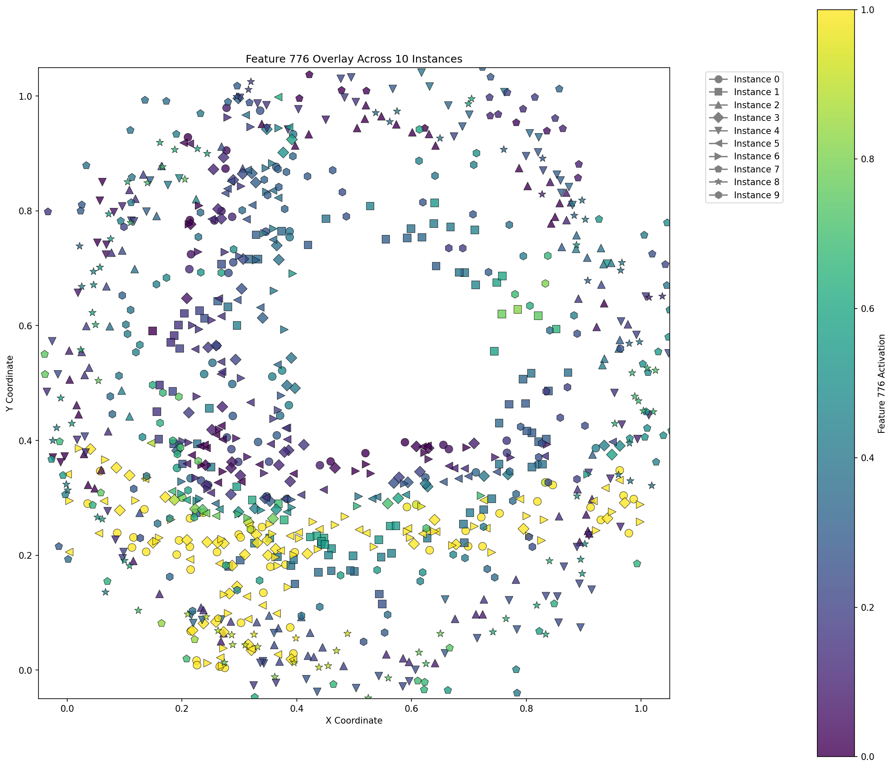

# TSP-interp: Applying mechanistic interpretability to the Traveling Salesman Problem

> **Note**: This is an ongoing research project. Code and documentation are continuously being improved.

## Overview

Solving combinatorial optimization problems can famously be NP-hard. Recent work has applied deep learning to find near-optimal solutions in much less time. However, these models are black boxes, and it is difficult to understand what they are doing. We believe that the model's internal representations contain information about the instance that may be useful for practitioners, but is currently inaccessible.

This repository contains code for interpreting the learned representations of a transformer-based policy for the Traveling Salesman Problem (TSP). Currently, we use Sparse Autoencoders (SAE) trained on activations from the encoder output of the policy to extract features. We also include tooling for visualizing the features.

### Future goals include:
- Training probes (both dense linear and on SAE features) to probe for attributes of TSP instances, such as difficulty.
- Training cross-layer transcoders to find causal relationships between layers, enabling an interpretable knowledge graph.

What *is* going on in there, anyway?

## Project Structure and Architecture

The project contains three main components:

1. **Environment (`env/`)**: TSP environment generator and Concorde solver integration
2. **Policy (`policy/`)**: Transformer-based policy models for solving TSP instances using reinforcement learning
3. **Sparse Autoencoder (`sae/`)**: Extracts interpretable features from the learned policy representation

## Installation

```bash
# Clone the repository
git clone https://github.com/ReubenNarad/TSP_interp.git
cd TSP_interp

# Install dependencies
pip install -r requirements.txt
```

This project requires the Concorde TSP Solver to be installed and accessible in your system's PATH. The code calls the `concorde` command directly. You can download Concorde from the [official website](https://www.math.uwaterloo.ca/tsp/concorde/downloads/downloads.htm) and follow their installation instructions to make it available as a command-line tool.

## Workflow and Usage

The project follows a 4-step workflow, using shell scripts:

### 1. Training a Policy
Currently, we use a Graph Attention Network (cite Kool et al), implemented by the RL4CO library (cite) REINFORCE method (modified to use clipped rewards), and TSP environment. The default TSP environment generates distances by drawing node locations from a uniform distribution in the unit square, with the option to modify it.

Specify the policy hyperparameters in `train_policy.sh`:

Key hyperparameters in `train_policy.sh`:
- `run_name`: Name of the policy run
- `num_epochs`: Number of training epochs
- `num_instances`: Number of TSP instances per epoch
- `num_loc`: Number of locations in each TSP instance
- `embed_dim`: Dimensionality of transformer embeddings
- `n_encoder_layers`: Number of transformer encoder layers

And then run:
```bash
bash train_policy.sh
```

### 2. Collecting Activations

After training the policy, collect activations from the encoder output by running the policy on a set of TSP instances drawn from the same distribution as the policy's training. This will be used as the training data for the sparse autoencoder:

Specify the policy run name and the number of instances to collect activations for in `collect_activations.sh`:

- `run_name`: Name of the policy run
- `num_instances`: Number of TSP instances to collect activations for

And then run:
```bash
bash collect_activations.sh
```

### 3. Training a Sparse Autoencoder

Train the SAE on the collected activations. We use a top-k sparse autoencoder (cite).

Specify the policy run name and the SAE run name in `train_sae.sh`:

- `run_name`: Name of the policy run
- `sae_run_name`: Name of the SAE run

And then run:
```bash
bash train_sae.sh
```

Key hyperparameters in `train_sae.sh`:
- `l1_coef`: L1 sparsity penalty coefficient
- `expansion_factor`: Ratio of latent dimensions to input dimensions
- `k_ratio`: Fraction of latent units allowed to be active

### 4. Analyzing Learned Features

Finally, visualize and analyze the most important features of the SAE. In `analyze_features.sh`, specify:

- `run_name`: Name of the policy run
- `sae_run_name`: Name of the SAE run
- `num_instances`: Number of instances to analyze
- `batch_size`: Batch size for feature analysis
- `num_features`: Number of features to analyze

And then run:
```bash
bash analyze_features.sh
```

This will generate a gallery of feature activations across num_instances instances.

## Feature Visualization

The sparse autoencoder learns interpretable features from the policy's neural representations. Here are some examples of the discovered features:

### Policy training

<table>
  <tr>
    <td></td>
    <td></td>
  </tr>
</table>

### Some interesting SAE features

<table>
  <tr>
    <td></td>
    <td></td>
    <td></td>
  </tr>
  <tr>
    <td></td>
    <td></td>
    <td></td>
  </tr>
</table>

## CLT Interactive Viewer

We ship a lightweight web viewer (FastAPI + vanilla JS) for exploring Cross-Layer Transcoder (CLT) features with live overlays, per-instance toggles, and policy tour visualization.

1. **Collect viewer tensors for a CLT run**
   ```bash
   python scripts/collect_clt_viewer_data.py \
     --run_dir runs/uniform_policy_v1 \
     --pair_name encoder_layer_0__to__encoder_output \
     --num_instances 12
   ```
   or run the convenience wrapper:
   ```bash
   RUN_NAME=uniform_policy_v1 scripts/local_uniform/collect_clt_viewer_data.sh
   ```
   Each CLT run then stores `viz/viewer_data/{manifest.json, instances.npz}` with node coordinates, CLT latents, and rollout tours.

2. **Launch the viewer**
   ```bash
   RUN_NAME=uniform_policy_v1 scripts/local_uniform/launch_clt_viewer.sh
   ```
   This sets the search root to `runs/${RUN_NAME}` and starts a FastAPI server (default `0.0.0.0:8501`). Open `http://localhost:8501` (or forward the port over SSH) to interactively:
   - Switch between any CLT run that has viewer data
   - Choose ranked or custom feature indices
   - Toggle which instances contribute to the overlay
   - Render policy tours with **standard**, **activation-threshold (blue vs. red)**, or **per-edge intensity** highlighting to surface where a feature is most active

Set `SEARCH_ROOT`, `HOST`, or `PORT` before launching to customize the server, or export `CLT_VIEWER_MANIFEST=/path/to/manifest.json` to load a single dataset.

## Road-Network (OSM) TSP Pools

This repo supports training on *non-Euclidean* road-network costs by precomputing a large `K×K` cost matrix once, then sampling `N×N` induced submatrices during training.

Build a Seattle pool (time costs, symmetric):

```bash
python -m road_tsp.build_pool \
  --pbf ../../GEPA_TSP/data/osm/Seattle.osm.pbf \
  --bbox 47.58,47.64,-122.36,-122.30 \
  --k 10000 \
  --weight time \
  --symmetrize min \
  --sample_margin 0.002 \
  --out_dir data/osm_pools/seattle_time_k10000_seed0
```

Train MatNet on `N=100` subproblems sampled from the pool:

```bash
python -m policy.train_matnet \
  --run_name matnet_seattle_pool_n100 \
  --pool_dir data/osm_pools/seattle_time_k10000_seed0 \
  --num_loc 100
```

Render a sanity-check GIF with road-snapped paths (requires `--pbf`):

```bash
python -m policy.eval_matnet \
  --run_name matnet_seattle_pool_n100 \
  --pbf ../../GEPA_TSP/data/osm/Seattle.osm.pbf
```

## License

This project is licensed under the MIT License - see the LICENSE file for details.

## Acknowledgments
- [RL4CO](https://rl4.co/) for implementation of RL for the TSP
- [Concorde TSP Solver](http://www.math.uwaterloo.ca/tsp/concorde.html) for optimal solutions
``` 
